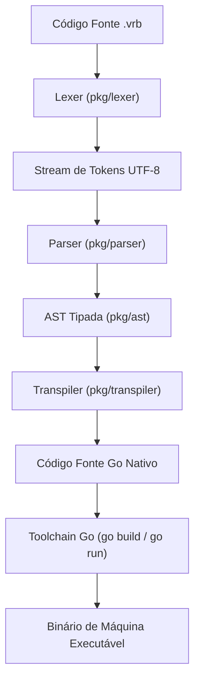

# 🏗️ Arquitetura do Compilador Verbo

## Visão Geral

O compilador Verbo é um **transpilador determinístico** que converte código-fonte `.vrb` em código Go nativo de alto desempenho.

Para detalhes dos nós da AST, camadas do compilador e arquitetura da BibVerbo, veja [Arquitetura Completa](referencia/arquitetura.md).
