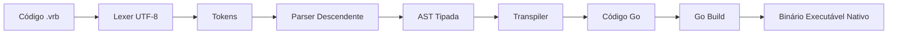

# Visão Geral e Filosofia

A linguagem **Verbo** foi desenvolvida para resolver uma desconexão histórica na computação: programadores lusófonos pensam e raciocinam em português, mas historicamente programam com vocabulário de base anglo-saxônica (`if`, `while`, `let`, `def`).

Verbo vai além de simplesmente traduzir palavras-chave em inglês para português. O projeto investigou profundamente a estrutura sintática da língua portuguesa para utilizá-la como alicerce semântico.

---

## Os 4 Pilares do Verbo

### 1. Ser vs. Estar (A Distinção Semântica Mais Poderosa)
Na língua portuguesa, existe uma distinção sutil e precisa que não existe em muitas línguas (como no inglês, onde ambos são expressos por *to be*):
- **Ser** denota essência, constância, propriedade imutável.
- **Estar** denota estado transitório, mutabilidade temporária.

No Verbo, essa regra determina diretamente a mutabilidade de variáveis:
```verbo
// Imutável (constante de essência):
O pi é 3.14159.

// Mutável (variável de estado):
Um contador está 0.
contador está 1.
```

### 2. Artigos Definidos e Indefinidos
Acompanhando o verbo, o artigo em português concorda gramaticalmente e reforça a semântica:
- **Artigos Definidos (`O`, `A`, `Os`, `As`)** apontam para entidades fixas e determinadas (Constantes).
- **Artigos Indefinidos (`Um`, `Uma`, `Uns`, `Umas`)** introduzem valores mutáveis (Variáveis).

### 3. Preposições como Conectores de Chamada
Chamadas de procedimentos utilizam regência verbal natural:
```verbo
// "Calcular de Calculadora com (10, 20)"
O resultado é Potencia de Matematica com (2.0, 8.0).
```

### 4. Ordem SVO Determinística
A gramática segue estritamente a ordem **Sujeito - Verbo - Objeto**, eliminando ambiguidades sintáticas para o compilador.

---

## Como o Verbo Funciona?

O compilador Verbo não é um interpretador lento. Ele é um **transpilador para Go**:



Graças à transpilação para Go, um programa escrito em Verbo:
1. Gera código fonte Go legível e canônico.
2. É compilado para binário de máquina estático sem dependências externas.
3. Possui coleta de lixo rápida e paralelismo nativo via *goroutines*.

