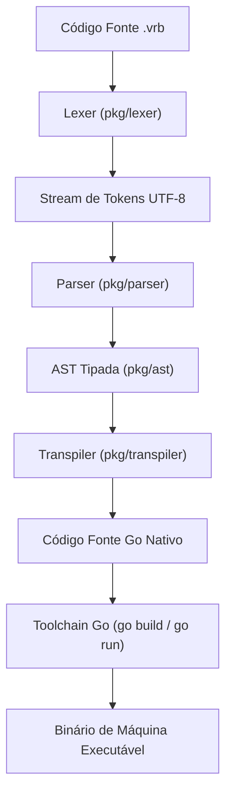
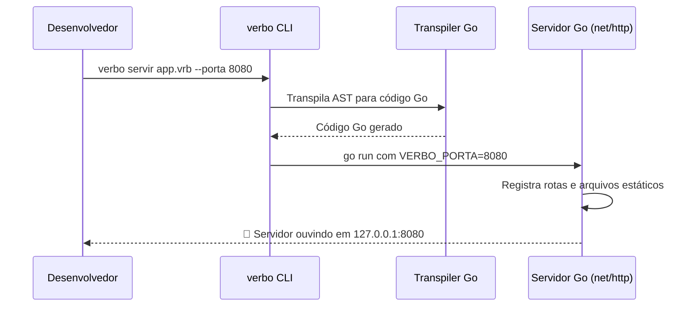

# Arquitetura do Compilador Verbo

O compilador Verbo é um **transpilador determinístico para Go** escrito integralmente em Go padrão, sem bibliotecas externas e sem dependências pesadas em tempo de execução.



---

## 1. Pipeline de Execução

O fluxo de processamento é dividido em quatro camadas bem isoladas:

### Camada 1: Lexer (`pkg/lexer/`)
- Lê o arquivo de entrada runa a runa em UTF-8 com suporte completo a acentuação gráfica (`é`, `ã`, `ç`).
- Reconhece identificadores, palavras reservadas da gramática lusófona, números literais, strings e símbolos.
- Realiza rastreamento preciso de posição (`Linha` e `Coluna`) para diagnósticos detalhados de erro.

### Camada 2: Parser e Validador Semântico (`pkg/parser/`)
- Implementa um algoritmo **Recursive Descent** (descendente recursivo).
- Constrói a Árvore de Sintaxe Abstrata (AST) validando a estrutura de blocos (`: ... .`), declaração de entidades e funções.
- Resolve a precedência de operadores matemáticos e lógicos sem ambiguidade.

### Camada 3: Transpiler AST → Go (`pkg/transpiler/`)
- Aplica o padrão **Visitor** sobre os nós da AST.
- Mapeia conceitos da língua portuguesa em código Go canônico e idiomático:
  - `O`/`A` com `é` → constante/imutável com verificação em tempo de compilação.
  - `Um`/`Uma` com `está` → variáveis mutáveis.
  - `Simultaneamente:` → goroutines com `sync.WaitGroup`.
  - `Tente:` / `Capture:` → closures com `defer` e `recover()`.
  - `Servidor com (...)` → rotas `net/http` e handlers Go.
  - `Incluir <Pacote>.` → imports automáticos para `pkg/stdlib/<pacote>`.

### Camada 4: CLI e Build Orchestrator (`cmd/verbo/`)
- Orquestra os comandos de linha de comando: `compilar`, `executar`, `verificar`, `servir` e `pacote`.
- Invoca o compilador `go build` ou `go run` gerenciando artefatos temporários e binários finais.

---

## 2. Mapa dos Nós da AST (`pkg/ast/ast.go`)

```
No (Interface Base)
├── Declaracao (Interface)
│   ├── Programa (Nó Raiz)
│   ├── DeclaracaoVariavel (Imutável ou Mutável)
│   ├── DeclaracaoFuncao (Para ... usando)
│   ├── DeclaracaoEntidade (Structs / Tipos)
│   ├── DeclaracaoSe (Condicionais)
│   ├── DeclaracaoRepita (Laços fixos e ForEach)
│   ├── DeclaracaoEnquanto (Laços condicionais)
│   ├── DeclaracaoSimultaneamente (Goroutines com WaitGroup)
│   ├── DeclaracaoTente (Try / Recover)
│   ├── DeclaracaoSinalize (Panic)
│   ├── DeclaracaoEnviar (Envio em Canal)
│   ├── DeclaracaoServidor (Criação do Servidor HTTP)
│   ├── DeclaracaoRota (Handlers de rota GET/POST/PUT/DELETE)
│   ├── DeclaracaoIniciarServidor (ListenAndServe)
│   ├── DeclaracaoIncluir (Importação da BibVerbo)
│   ├── DeclaracaoRetorne (Retorno de função)
│   ├── DeclaracaoAtribuicao (Reatribuição de estado)
│   └── DeclaracaoExibir (Impressão / Saída)
└── Expressao (Interface)
    ├── ExpressaoLiteralNumero / Texto / Logico / Nulo
    ├── ExpressaoIdentificador
    ├── ExpressaoBinaria / Unaria / Agrupada
    ├── ExpressaoChamadaFuncao
    ├── ExpressaoLista (Coleções literais)
    ├── ExpressaoAcessoIndice (`lista[0]`)
    ├── ExpressaoAcessoCampo (`campo de objeto`)
    ├── ExpressaoInstanciacao (`novo Tipo contendo (...)`)
    ├── ExpressaoCriarCanal (`Canal de Tipo`)
    └── ExpressaoReceber (`Receber de canal`)
```

---

## 3. Arquitetura da Biblioteca Padrão (BibVerbo)

A BibVerbo reside no pacote `pkg/stdlib/` e é compilada junto ao binário final:

| Módulo Go | Pacote | Responsabilidade |
| :--- | :--- | :--- |
| `pkg/stdlib/matematica/` | `matematica` | Funções de precisão matemática via `math` |
| `pkg/stdlib/texto/` | `texto` | Operações e transformações UTF-8 via `strings` |
| `pkg/stdlib/arquivo/` | `arquivo` | Entrada e saída em disco via `os` |
| `pkg/stdlib/html/` | `html` | Geração e templates HTML tipados |
| `pkg/stdlib/internet/` | `internet` | Cliente HTTP resiliente, sockets TCP/UDP e resolução DNS |
| `pkg/stdlib/criptografia/` | `criptografia` | Criptografia simétrica AES-256-GCM, SHA-256, HMAC e UUID v4 |

---

## 4. Ciclo de Vida do Servidor Web e CLI


