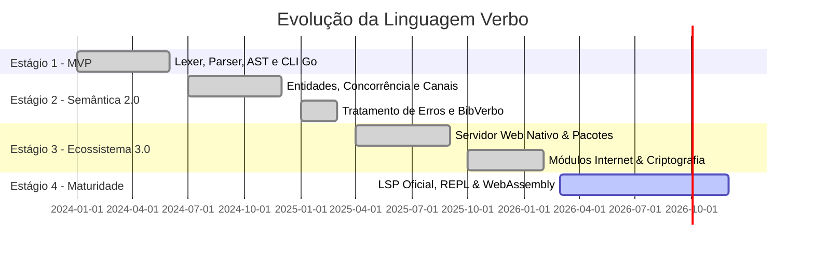

# Roadmap de Evolução da Linguagem Verbo

Planejamento estratégico de desenvolvimento e marcos de versão da linguagem Verbo.

---

## Status dos Estágios de Desenvolvimento

---

## Estágio 1: MVP Funcional ✅ (Concluído)

- [x] Analisador Léxico UTF-8 com suporte completo à acentuação.
- [x] Parser descendente recursivo com AST tipada.
- [x] Transpilador AST → Go nativo.
- [x] Tipos primitivos (`Texto`, `Inteiro`, `Decimal`, `Lógico`, `Nulo`).
- [x] Semântica de imutabilidade via artigos (`O`/`A` = constante, `Um`/`Uma` = variável).
- [x] Funções com parâmetros tipados e retorno (`Para ... usando: ... Retorne`).
- [x] Estruturas de controle (`Se ... então / Senão`, `Repita ... vezes`, `Enquanto`).
- [x] Ferramenta CLI (`verbo compilar`, `verbo executar`, `verbo verificar`).

---

## Estágio 2: Verbo 2.0 Semântica Avançada ✅ (Concluído)

- [x] **Entidades estruturadas**: Declaração com `A entidade Nome contendo (...)`.
- [x] **Acesso por preposições**: Acesso a propriedades com `campo de objeto`.
- [x] **Listas literais e iteração**: Suporte a coleções `[1, 2, 3]` e `Repita para cada item em lista:`.
- [x] **Concorrência com goroutines**: Bloco `Simultaneamente:`.
- [x] **Canais tipados**: `Canal de Inteiros`, comandos `Enviar ... para` e `Receber de`.
- [x] **Tratamento de erros robusto**: Blocos `Tente: ... Capture erro:` com `Sinalize`.
- [x] **Biblioteca Padrão Inicial (BibVerbo)**: Módulos `Matematica`, `Texto`, `Arquivo` e `Html`.

---

## Estágio 3: Ecossistema & Web ✅ (Concluído)

- [x] **Servidor Web Nativo**: `Servidor com (local, 8080)`, rotas `GET/POST/PUT/DELETE` e comando `verbo servir`.
- [x] **Gerenciador de Pacotes Oficial**:
  - Manifesto `verbo.mod.json` e lockfile `verbo.lock.json`.
  - Instalação remota (`gh:usuario/repo@ref`) e local (`path:./pacote`).
  - Execução segura de scripts de pós-instalação `installer.vrb`.
- [x] **BibVerbo Internet**: Cliente HTTP completo, Sockets TCP cliente/servidor, UDP e DNS.
- [x] **BibVerbo Criptografia**: Hashes (SHA-256, SHA-512, HMAC), Base64, AES-256-GCM autenticado, UUIDs v4 e aleatoriedade estatística.
- [x] **Extensão para VS Code**: Realce de sintaxe TextMate, diagnósticos em tempo real e atalhos de código.

---

## Estágio 4: Maturidade e Plataforma 🚀 (Em Andamento)

- [ ] **LSP (Language Server Protocol) Oficial**: Autocompletação em tempo real, go-to-definition e refatorações automáticas.
- [ ] **REPL Interativo**: Terminal interativo `verbo repl` para prototipação imediata.
- [ ] **Formatador Oficial de Código**: Comando `verbo formatar` para padronização automática da indentação e pontuação.
- [ ] **Compilação para WebAssembly (WASM)**: Permitir a execução de binários Verbo diretamente no navegador web.
- [ ] **Playground Web Interativo**: Editor online com execução e compartilhamento de códigos Verbo.
- [ ] **Integração com o Ecossistema Crom**: Suporte a smart contracts e scripts de automação em português culto.
